<!-- Created with the Wolfram Language for Students - Personal Use Only : www.wolfram.com -->

<html xmlns="http://www.w3.org/1999/xhtml">
<head>
 <title>
  Untitled (the Wolfram Language for Students - Personal Use Only : www.wolfram.com)
 </title>
 <link href="HTMLFiles/Compiling_and_Generating_Code.css" rel="stylesheet" type="text/css" />
 
</head>

<body>

 Code compilation

 Mathematica code is by default interpreted by the Mathematica kernel

 The kernel can also compile a subset of Mathematica code for better performance

 e.g. approximate &pi; numerically

 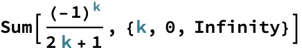

 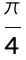

 Truncate this sum at n terms

 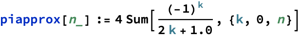

 

 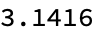

 

 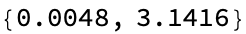

 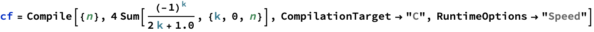

 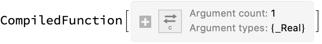

 

 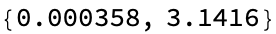

 

 

 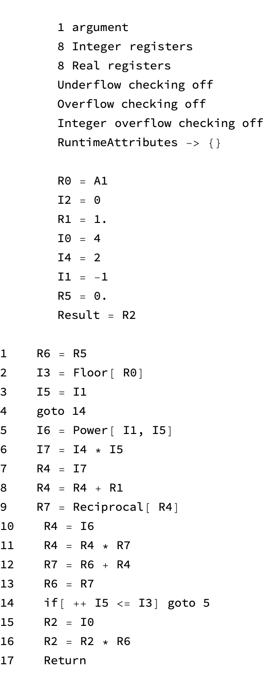

 Generating code

 

 

 

 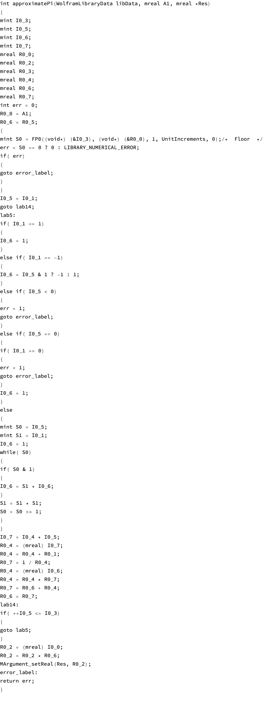

 

 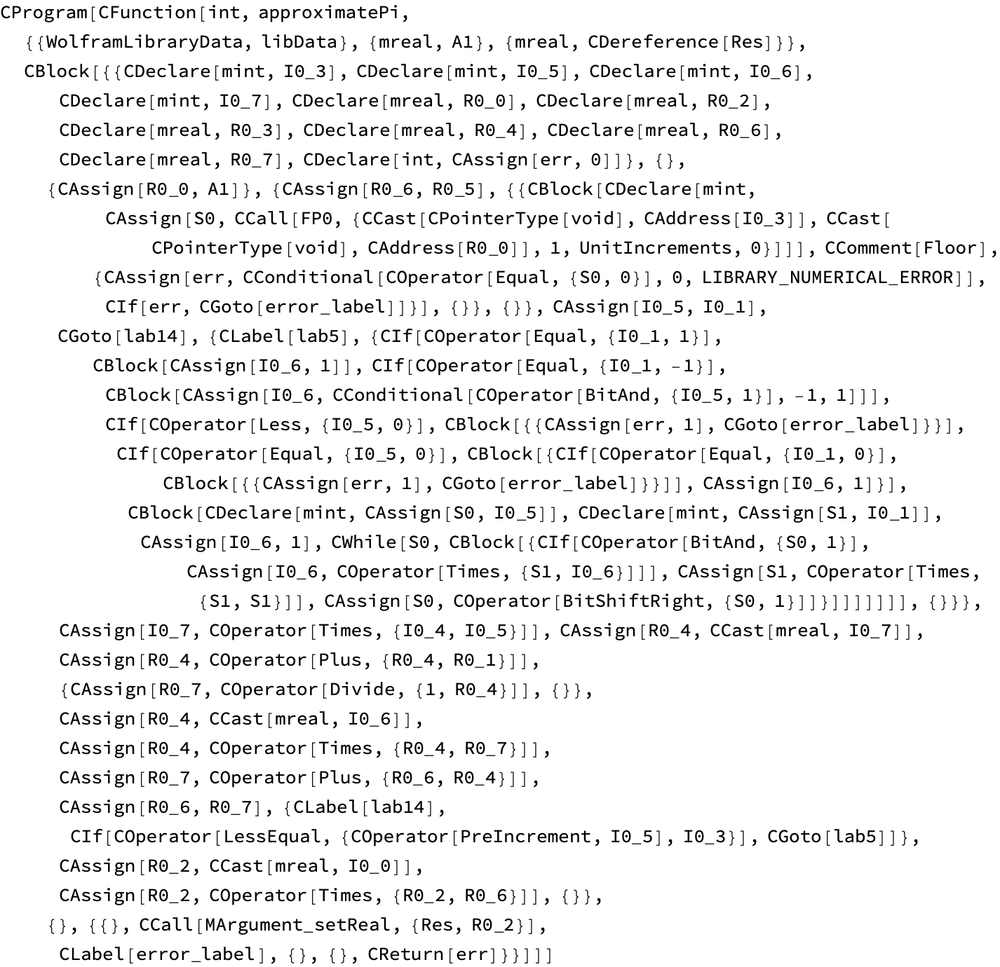

 JIT Compilation

 Suppose we want to roll our own JIT compilation

 We want to speed up Select, which returns those elements of a list that match a pattern

 

 

 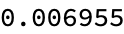

 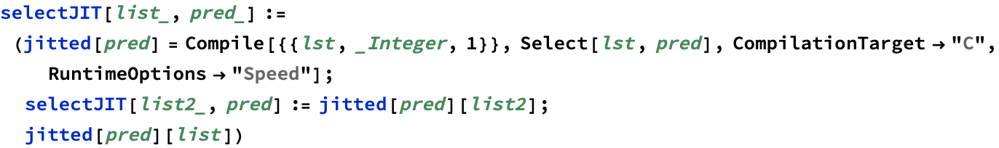

 

 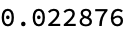

 

 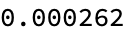

 

 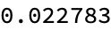

 

 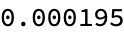

 <a href="http://www.wolfram.com/language/" style="color:#000; text-decoration:none;">
  Created with the Wolfram Language 
 </a>

</body>

</html>
