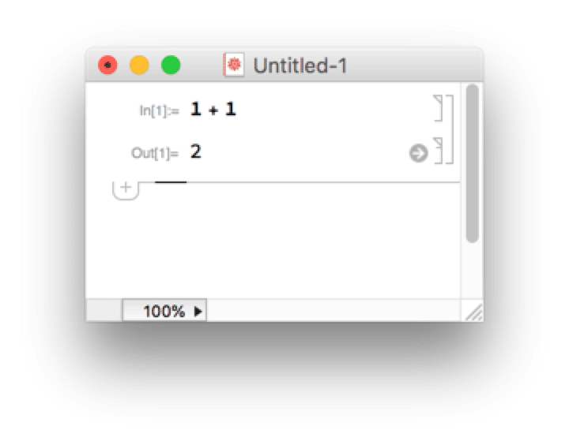
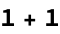
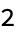

<!-- Created with the Wolfram Language for Students - Personal Use Only : www.wolfram.com -->

<html xmlns="http://www.w3.org/1999/xhtml">
<head>
 <title>
  IntroductionEx (the Wolfram Language for Students - Personal Use Only : www.wolfram.com)
 </title>
 <link href="HTMLFiles/IntroductionEx.css" rel="stylesheet" type="text/css" />
 
</head>

<body>

 What is Mathematica?

 Mathematica is a powerful symbolic computation program running the Wolfram Language. It was created by Stephen Wolfram and is used widely for mathematical, scientific, and engineering applications. 

 The notebook interface

 Very similar to Jupyter notebooks

 Enter code/expressions in a cell

 Shift-return (or enter on the numeric keypad) evaluates the expression

 The output is shown below the input cell

 

 

 

 <a href="http://www.wolfram.com/language/" style="color:#000; text-decoration:none;">
  Created with the Wolfram Language 
 </a>

</body>

</html>
