<!-- Created with the Wolfram Language for Students - Personal Use Only : www.wolfram.com -->

<html xmlns="http://www.w3.org/1999/xhtml">
<head>
 <title>
  Untitled (the Wolfram Language for Students - Personal Use Only : www.wolfram.com)
 </title>
 <link href="HTMLFiles/Procedural_Control_Flow.css" rel="stylesheet" type="text/css" />
 
</head>

<body>

 Procedural control flow

 Mathematica also has procedural control flow (perhaps more familiar from e.g. Julia)

 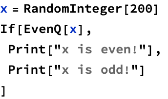

 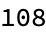

 

 Which can be used for many if-else clauses

 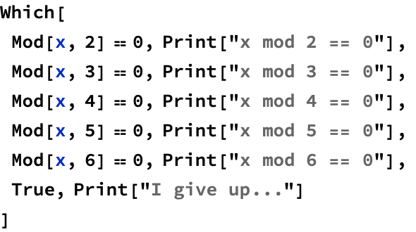

 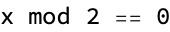

 The simplest loop is the Do loop, which repeats the contents n times

 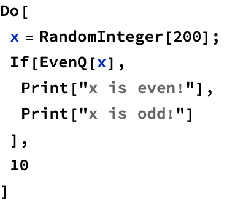

 

 

 

 

 

 

 

 

 

 

 We also have traditional for loops

 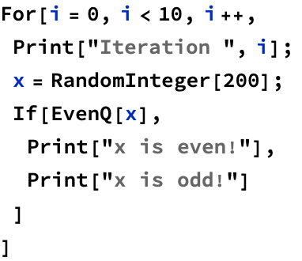

 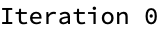

 

 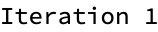

 

 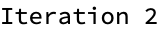

 

 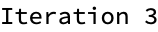

 

 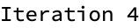

 

 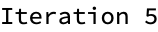

 

 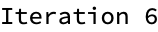

 

 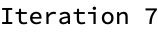

 

 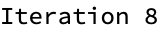

 

 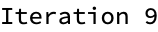

 

 Application: merge sort

 Merge sort is a recursive algorithm Given a list, we: 1. find a midpoint 2. split the list at its midpoint into a left list and right list 3. sort the left and right lists using merge sort (recursion) 4. merge the two lists

 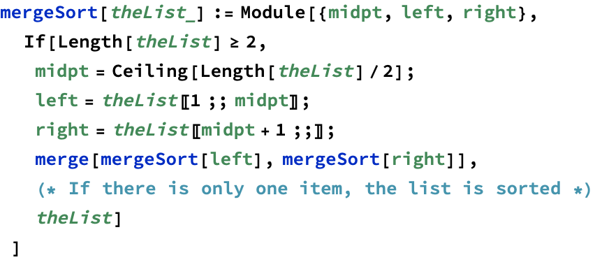

 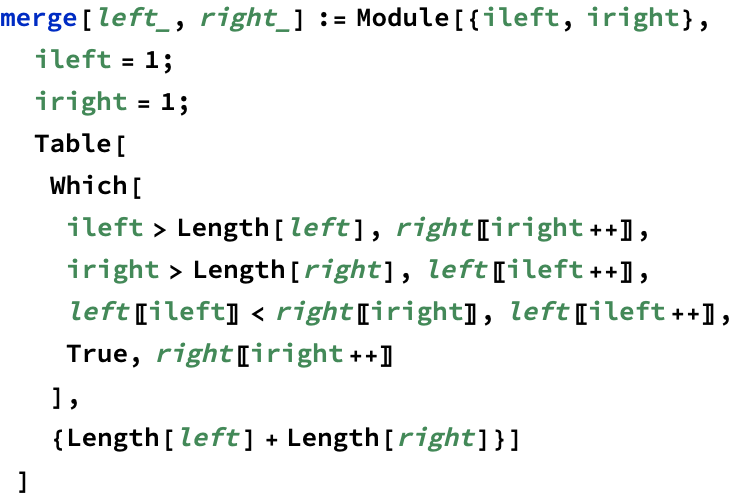

 

 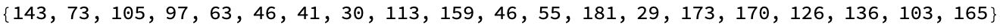

 

 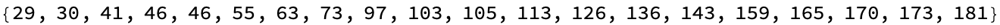

 The runtime complexity of merge sort is given by the recurrence t(n)=2t(n/2)+O(n)

 

 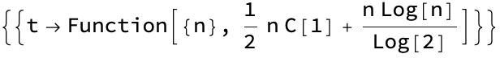

 The runtime complexity is n log(n)

 Functional-style merge sort

 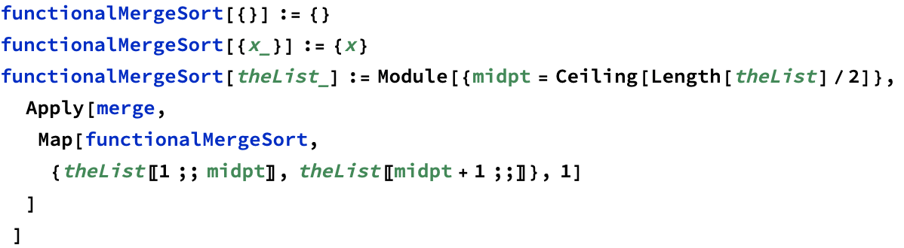

 

 

 Finding all primes less than n

 Algorithm known as the Sieve of Eratosthenes

 Choose a number n We will find all primes less than n 1. List all numbers 2 through n 2. Starting with, p=2, mark all multiples of p, beginning with 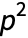 &nbsp;&nbsp;&nbsp;&nbsp;i.e. mark 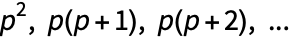 up to n 3. Repeat step 2 with p the next unmarked number 4. Terminate when 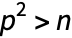

 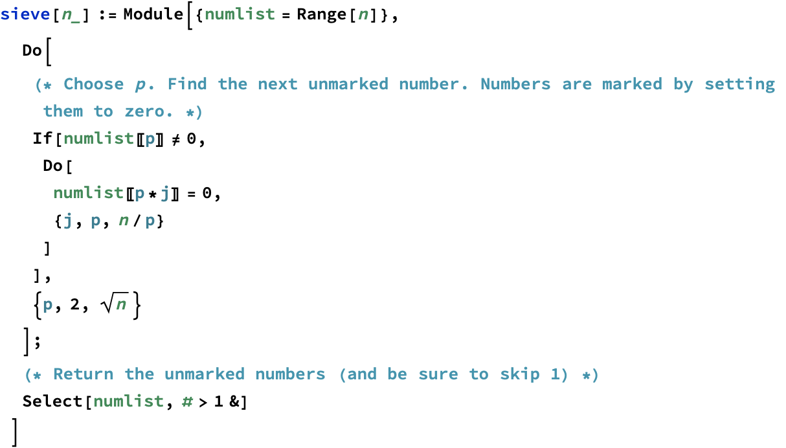

 

 

 Let&rsquo;s check our work...

 

 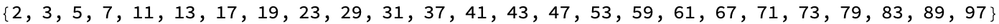

 We can also use a functional approach

 

 

 

 <a href="http://www.wolfram.com/language/" style="color:#000; text-decoration:none;">
  Created with the Wolfram Language 
 </a>

</body>

</html>
