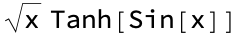
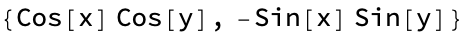
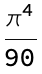
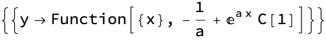
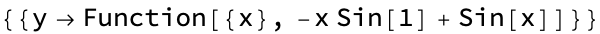

<!-- Created with the Wolfram Language for Students - Personal Use Only : www.wolfram.com -->

<html xmlns="http://www.w3.org/1999/xhtml">
<head>
 <title>
  Untitled (the Wolfram Language for Students - Personal Use Only : www.wolfram.com)
 </title>
 <link href="HTMLFiles/Calculus.css" rel="stylesheet" type="text/css" />
 
</head>

<body>

 Using Mathematica for calculus

 Mathematica is what Wolfram Alpha is based on&#8232;(You may be familiar from Math 1A...)

 There is very powerful built-in differentiation and integration of expressions:

 

 

 Integrate can be used to compute indefinite integrals

 

 

 Providing bounds of integration in the form of a list (just like in plotting) can be used to compute definite integrals

 

 

 Numerical (approximate results) can be obtained using the N function

 

 

 

 

 If we want to be fancy, we can use mathematical notation in our code:

 

 

 

 

 More calculus and series

 Mathematica can easily compute partial and repeated derivatives

 

 

 

 

 

 

 

 

 Finite and infinite sums can be computed using Sum

 

 

 

 

 

 

 

 

 Differential equations

 Mathematica can find analytical solutions to many differential equations, both initial value problems and boundary value problems

 The function DSolve looks for solutions to differential equations

 

 

 We did not specify an initial condition, so the solution has a constant. Specifying the initial condition eliminates the constant

 

 

 

 

 

 

 

 

 We can solve a boundary value problem:

 

 

 

 

 <a href="http://www.wolfram.com/language/" style="color:#000; text-decoration:none;">
  Created with the Wolfram Language 
 </a>

</body>

</html>
