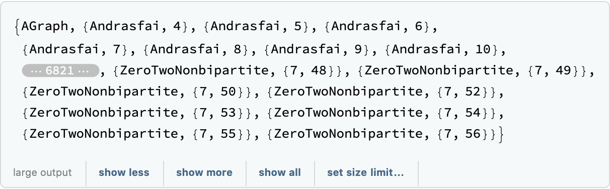
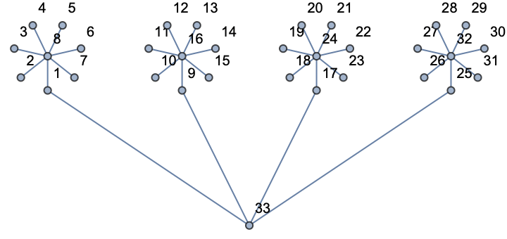

<!-- Created with the Wolfram Language for Students - Personal Use Only : www.wolfram.com -->

<html xmlns="http://www.w3.org/1999/xhtml">
<head>
 <title>
  Untitled (the Wolfram Language for Students - Personal Use Only : www.wolfram.com)
 </title>
 <link href="HTMLFiles/Graphs.css" rel="stylesheet" type="text/css" />
 
</head>

<body>

 Graph algorithms

 There is sophisticated built-in support for graphs and graph algorithms

 There are lots of built-in graphs obtainable using GraphData, e.g.

 

 
<map name="map_2">
<area shape="rect" coords="13,178,72,168" title="Dynamic[FEPrivate`FrontEndResource[FEStrings, sizeExplanation]]" nohref="" />
</map>

 

 

 

 

 Let&rsquo;s perform a depth-first search on this tree

 We start with the root node (33) in our case, and visit each node in the graph by first visiting all the children of a given node before visiting any of its siblings

 

 We will need to find the neighbors of a given node:

 

 

 We also don&rsquo;t want to visit our parent, so we will use Cases and Except to skip items

 

 

 

 

 

 

 

 

 

 

 

 

 

 

 

 

 

 

 

 

 

 

 

 

 

 

 

 

 

 

 

 

 

 

 

 

 

 

 

 

 

 

 

 

 

 

 

 

 

 

 

 

 

 

 

 

 

 

 

 

 

 

 

 

 

 

 

 

 

 

 

 

 

 

 

 

 

 

 

 

 

 

 

 

 

 

 

 

 

 

 

 

 

 

 

 

 

 

 

 

 

 

 

 

 

 

 

 

 

 

 

 

 

 

 

 

 

 

 

 <a href="http://www.wolfram.com/language/" style="color:#000; text-decoration:none;">
  Created with the Wolfram Language 
 </a>

</body>

</html>
