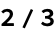
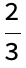
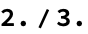

<!-- Created with the Wolfram Language for Students - Personal Use Only : www.wolfram.com -->

<html xmlns="http://www.w3.org/1999/xhtml">
<head>
 <title>
  Simple_Computation (the Wolfram Language for Students - Personal Use Only : www.wolfram.com)
 </title>
 <link href="HTMLFiles/Simple_Computation.css" rel="stylesheet" type="text/css" />
 
</head>

<body>

 Simple arithmetic

 The usual operations work:

 

 

 Note: division of integers gives rational numbers not floating point:

 

 

 Numbers with decimal points are interpreted as inexact (i.e. double precision floating point)

 

 

 Group expressions using parentheses. Multiplication can be perform by adding a space (a gray x will appear):

 

 

 

 

 More computations

 There are a huge number of mathematical functions built in:

 

 

 Sin, Cos, Log, Exp, Gamma, Erf

 Note:

 All built-ins in Mathematica begin with a capital letter

 Even constants, e.g. Pi, E, and I

 This leaves all lowercase-beginning identifiers for user code

 Function call syntax

 Unlike in Julia, functions are called with square brackets

 Examples:

 

 

 

 

 

 

 As in Julia, arguments are separated by commas:

 

 

 <a href="http://www.wolfram.com/language/" style="color:#000; text-decoration:none;">
  Created with the Wolfram Language 
 </a>

</body>

</html>
